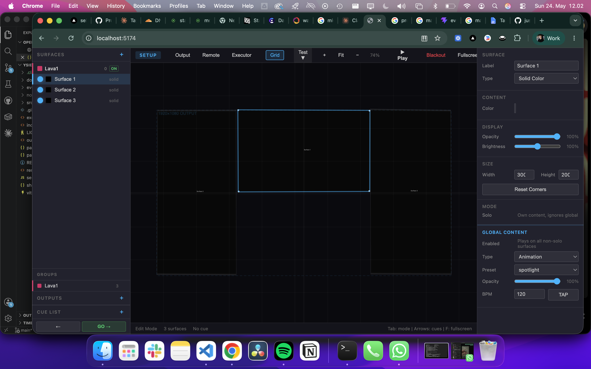
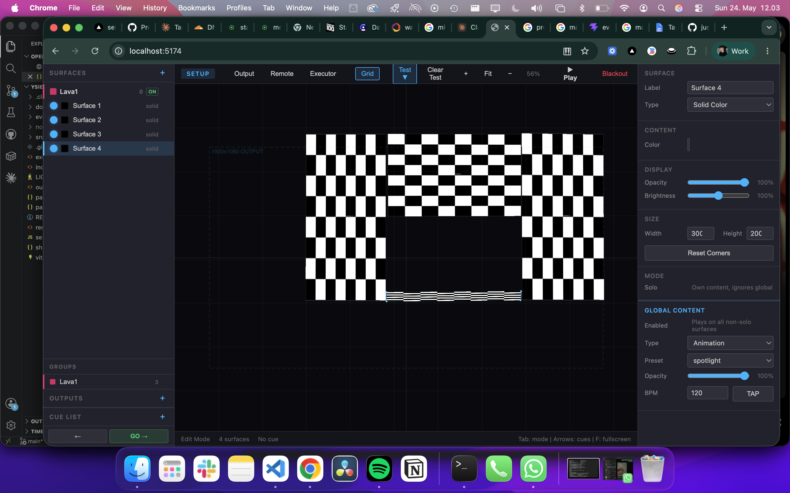
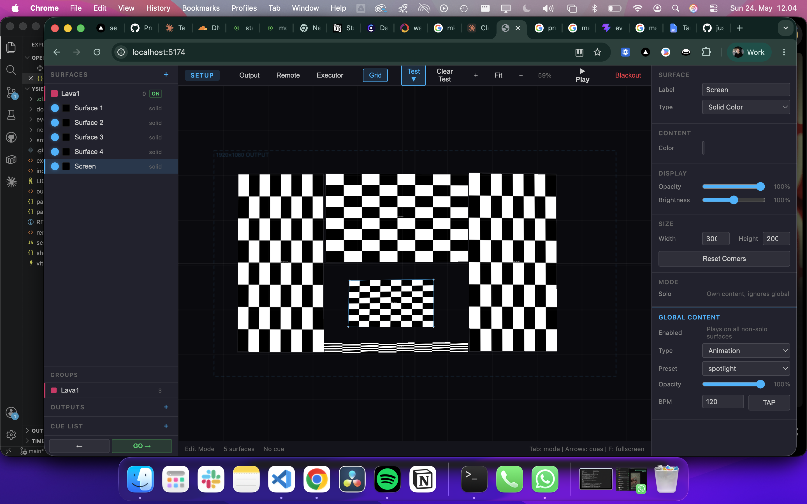
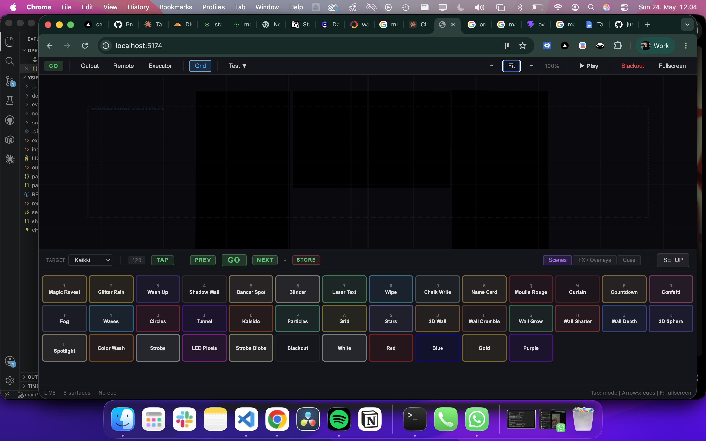
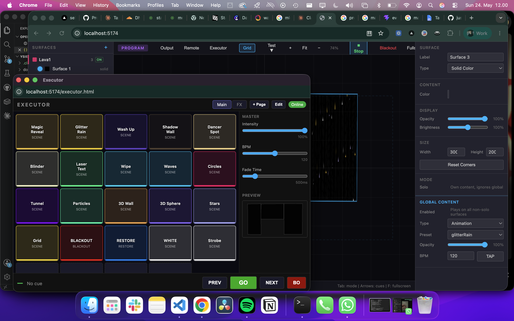
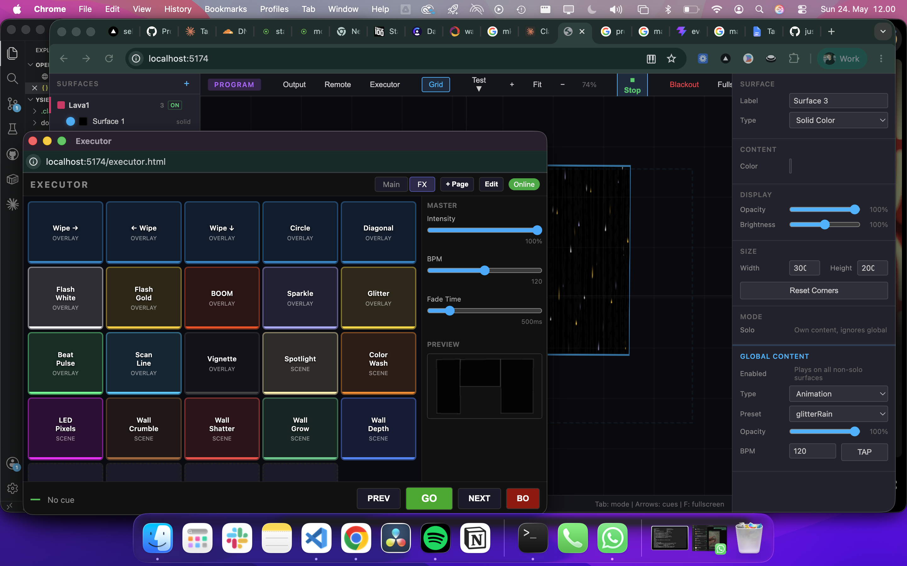
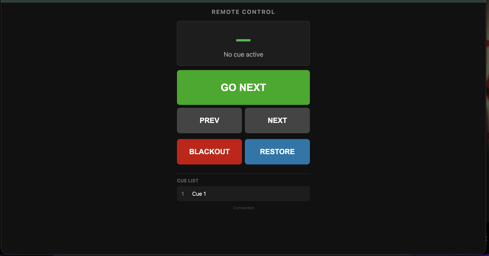
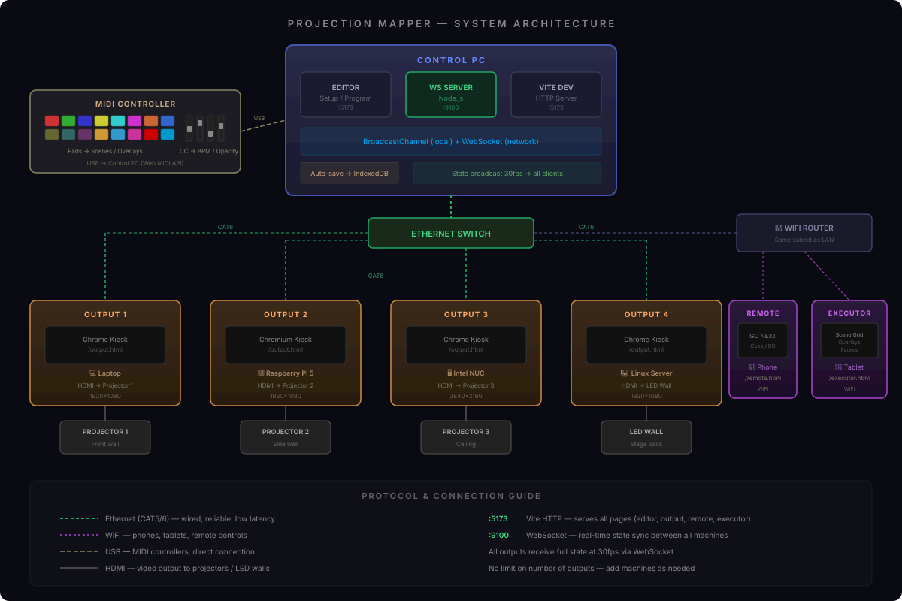

# Projection Mapper

A browser-based projection mapping tool for live events. Map content onto arbitrary surfaces, control cues in real time, and drive multiple output windows — all from a single browser tab.

Built with vanilla JavaScript and Vite. No frameworks, no build dependencies beyond Vite.


## Screenshots

### Edit mode — surface mapping with grid overlay


### Test patterns — calibration with checkerboard


### Multi-surface — mapping multiple areas


### Program mode — live scene control with keyboard shortcuts


### Executor — GrandMA-style button grid (scenes)


### Executor — FX page (overlays and effects)


### Remote control — phone interface for cue navigation


## System architecture



## Features

- **Surface mapping** — create surfaces and drag corners to fit any projection target. Uses CSS `matrix3d` homography to warp content in real time.
- **40+ animation presets** — waves, particles, fire, plasma, 3D terrain, laser text, matrix rain, and more. All generated on canvas, no external assets.
- **Content types** — solid color, image, video, text (with Google Fonts), freehand drawing, and generative animations.
- **Groups** — combine surfaces into groups that share a single content source, automatically sliced per surface.
- **Global content** — broadcast one animation or color to all ungrouped surfaces at once.
- **Cue list** — GrandMA3-style cue system. Capture snapshots, navigate with fade transitions, control from a separate device.
- **Scenes** — one-click scene presets organized by category: show, VJ, lighting, 3D, and utility.
- **Overlays** — stack effects on top of content: wipes, flashes, sparkles, scan lines, vignette, boom shockwave.
- **Test patterns** — checkerboard, grid, color bars, numbering, gradients for calibration.
- **Multi-window output** — open dedicated output windows, drag them to projectors, go fullscreen.
- **Remote control** — open a remote panel on your phone to navigate cues and trigger blackout.
- **BPM sync** — tap tempo or set BPM manually; animations sync to the beat.
- **Auto-save** — all settings persist to IndexedDB automatically. Export/import as JSON.
- **Zoom & pan** — scroll to zoom, middle-click to pan, grid overlay for alignment.

## Quick start

```bash
git clone git@github.com:justusbernerdev/projection-mapper.git
cd projection-mapper
npm install
npm run dev
```

Open `http://localhost:5173` in your browser.

## Usage

### Editor (main window)

1. Click **+ New Surface** to create a projection surface.
2. Drag the blue corner handles to match your physical projection target.
3. Choose a content type in the sidebar (animation, text, image, video, etc.).
4. Adjust opacity, brightness, and other properties.

### Output (projector)

1. Click **Open Output Window** in the sidebar.
2. Drag the output window to your projector/extended display.
3. Press **F** for fullscreen.
4. Press **Tab** to switch to performance mode (hides all UI).

### Remote control

1. Click **Open Remote Control** in the sidebar.
2. A small window opens — navigate cues, trigger blackout, and go live from your phone or second screen.

### Executor (GrandMA-style)

1. Click **Executor** in the toolbar (or open `/executor.html` directly).
2. A grid of programmable buttons — each can trigger a scene, overlay, or cue.
3. Click **Edit** to customize buttons: assign scenes, overlays, cues, blackout, or restore.
4. Multiple pages — swipe between Main, FX, and custom pages.
5. Fader strip on the right for intensity, BPM, and fade time.
6. Works over the network via WebSocket — run on a tablet as a dedicated control surface.

### Network status page

Open `/status.html` (or click **Status** in the toolbar) to see all connected devices, test connections, and debug your setup.

- Live device list — see every connected control, output, remote, and executor
- Connection tests — WebSocket, BroadcastChannel, latency measurement
- Quick actions — flash all outputs, identify screens, blackout test

### Multi-machine setup (WebSocket)

For running the output on a separate machine (media server):

```bash
# On control PC — start both Vite and WebSocket server
npm start

# Or separately:
npm run dev      # Vite dev server (port 5173)
npm run server   # WebSocket server (port 9100)
```

On the media server machine, open `http://<control-pc-ip>:5173/output.html` in Chrome kiosk mode. The output window will connect via WebSocket automatically.

Remote controls, executors, and output windows on other machines all communicate through the WebSocket server on port 9100.

### Example: event with projector + WiFi displays

A typical event setup with one projector server and multiple wireless displays (CleverTouch, info TV, etc.):

```
                         ┌─────────────────────────────┐
                         │        CONTROL PC            │
                         │  (MacBook / laptop)          │
                         │                              │
                         │  npm run dev    → :5173      │
                         │  npm run server → :9100      │
                         │  Editor UI on built-in screen│
                         └──────────┬────────────────────┘
                                    │ CAT6
                              ┌─────┴─────┐
                              │  SWITCH   │
                              └──┬─────┬──┘
                  CAT6 ┌────────┘     └────────┐ CAT6
                       │                       │
            ┌──────────┴──────────┐   ┌────────┴──────────┐
            │   MEDIA SERVER      │   │   WIFI ROUTER     │
            │   (Linux/NUC/RPi)   │   │   (local network) │
            │                     │   │   192.168.1.0/24   │
            │   Chrome kiosk:     │   └────────┬──────────┘
            │   /output.html      │            │ WiFi
            │        │            │     ┌──────┼──────────┐
            │        │ HDMI       │     │      │          │
            └────────┼────────────┘     │      │          │
                     │               ┌──┴──┐ ┌─┴───┐ ┌───┴──┐
              ┌──────┴──────┐       │ TV 1│ │TV 2 │ │TV 3  │
              │  PROJECTOR  │       │     │ │     │ │      │
              │  (wall/     │       │info │ │lobby│ │stage │
              │   ceiling)  │       │     │ │     │ │      │
              └─────────────┘       └─────┘ └─────┘ └──────┘
                                    Chrome: /output.html
                                    (each TV = own browser)
```

**Setup steps:**

1. Connect control PC to switch via Ethernet
2. Connect media server (projector) to switch via Ethernet
3. Connect WiFi router to switch via Ethernet
4. All devices are now on the same network

**On control PC:**
```bash
cd projection-mapper
npm run dev &       # Vite on port 5173
npm run server      # WebSocket on port 9100
```

**On media server (projector):**
```bash
# Autostart Chrome in kiosk mode pointing to control PC
chromium --kiosk --app=http://192.168.1.100:5173/output.html
```

**On each WiFi display (CleverTouch / info TV / smart TV):**
Open Chrome and navigate to `http://192.168.1.100:5173/output.html` → press F11 for fullscreen.

**On phone (cue control):**
Open `http://192.168.1.100:5173/remote.html` on any phone connected to the WiFi.

**Verify everything works:**
Open `http://192.168.1.100:5173/status.html` — you should see all devices listed. Use "Flash All" to confirm every display is receiving.

### Keyboard shortcuts

| Key | Action |
|-----|--------|
| `Tab` | Toggle Edit / Performance mode |
| `F` | Fullscreen |
| `Esc` | Exit fullscreen |
| `B` | Blackout |
| `R` | Restore all |
| `Space` | Toggle selected surface visibility |
| `S` | Save config |
| `H` | Hide/show UI (edit mode) |
| `G` | Toggle grid |
| `1`-`9` | Select surface by number |
| `Arrow keys` | Previous/next cue |

### Modes

- **Edit** — design surfaces, adjust geometry and content.
- **Program** — control scenes, BPM, overlays, and cues with a dedicated panel.
- **Performance** — clean output, no UI. Ready for showtime.

## Architecture

```
src/
  state.js            # Central state (surfaces, groups, mode, global content)
  surface.js          # Surface creation and defaults
  renderer.js         # Render loop — content, groups, overlays, test patterns
  homography.js       # 3x3 homography → CSS matrix3d
  cueList.js          # Cue capture, navigation, fade transitions
  scenes.js           # Scene presets (show, VJ, lighting, 3D, utility)
  overlays.js         # Overlay effects (wipes, flashes, sparkles)
  stageScale.js       # Viewport zoom, pan, fit-to-container
  outputWindow.js     # Output window management
  transport.js        # Unified BroadcastChannel + WebSocket transport
  midi.js             # MIDI controller input (Web MIDI API)
  server.js           # Node.js WebSocket server (root level)

  content/
    animation.js      # 40+ generative animation presets
    solid.js          # Solid color fill
    image.js          # Image rendering
    video.js          # Video playback
    text.js           # Text with fonts, wrapping, styling
    drawing.js        # Freehand drawing renderer
    drawingInput.js   # Drawing input with inverse homography
    testPatterns.js   # Calibration test patterns

  ui/
    sidebar.js        # Main sidebar UI
    cornerHandles.js  # Draggable corner handles
    grid.js           # Grid overlay
    programMode.js    # Program mode panel

  utils/
    keyboard.js       # Keyboard shortcuts
    storage.js        # Auto-save, export/import, project management
    db.js             # IndexedDB wrapper
```

### Rendering pipeline

1. Pre-render group canvases (one offscreen canvas per group).
2. For each surface, determine content source: **test pattern > group > global > solo > black**.
3. Render content to the surface's internal canvas.
4. Apply overlays on top.
5. Apply CSS `matrix3d` homography transform to the DOM element.
6. Broadcast state to output windows via `BroadcastChannel` at ~30fps.

### Coordinate system

All surfaces live in a **1920 x 1080** coordinate space regardless of window size. The editor viewport scales and pans to show this space. Output windows render at native resolution.

### Storage

- **IndexedDB** for persistent project data (supports multiple projects).
- **Auto-save** — checks for changes every second, saves with 500ms debounce.
- **JSON export/import** for backup and sharing.

## Hardware setup

### How many outputs?

There is **no hard limit** on the number of outputs. Each output is a separate browser window that can be placed on any connected display.

| Setup | Outputs | Description |
|-------|---------|-------------|
| **Minimal** | 1 | One laptop, one projector (HDMI/USB-C) |
| **Dual** | 2 | Two projectors from one machine |
| **Multi-machine** | Unlimited | Each media server runs one or more outputs, connected via LAN |

### Recommended hardware

**Control PC (operator)**
- Any laptop/desktop running Chrome
- Display for the editor UI
- Optional: MIDI controller, second screen for executor

**Media server (per projector)**
- Any machine with HDMI out (Raspberry Pi 4/5, Intel NUC, old laptop, etc.)
- Chrome in kiosk mode: `chromium --kiosk --app=http://<control-ip>:5173/output.html`
- Connected to control PC via Ethernet (CAT5/6)

**Network**
- Ethernet switch connecting control PC + media servers (wired = reliable)
- WiFi router for phone/tablet remote controls
- All devices on the same subnet

### Example setups

**Small event (1 projector)**
```
[Laptop] ──HDMI──> [Projector]
   └── Chrome: editor + output on extended display
```

**Medium event (2-3 projectors)**
```
[Control PC] ──Ethernet──> [Switch] ──> [Media Server 1] ──HDMI──> [Projector 1]
                              ├──────> [Media Server 2] ──HDMI──> [Projector 2]
                              └──WiFi──> [Phone: Remote Control]
```

**Large event (4+ projectors)**
```
[Control PC] ──Ethernet──> [Switch] ──> [Media Server 1] ──HDMI──> [Projector 1]
   ├── Executor (tablet)       ├──────> [Media Server 2] ──HDMI──> [Projector 2]
   ├── MIDI controller         ├──────> [Media Server 3] ──HDMI──> [Projector 3]
   └── WebSocket server        ├──────> [Media Server 4] ──HDMI──> [Projector 4]
                               └──WiFi──> [Phone 1: Remote]
                                          [Phone 2: Remote]
```

### Media server deployment

On each media server machine:

```bash
# Option A: Open output directly from control PC's Vite server
chromium --kiosk --app=http://192.168.1.100:5173/output.html

# Option B: Build and serve static files locally
npm run build
# Copy dist/ to media server, serve with any HTTP server
npx serve dist
```

The output page automatically connects to the WebSocket server for state updates. If WebSocket is unavailable, it falls back to BroadcastChannel (same-machine only).

### MIDI controller

Any class-compliant USB MIDI controller works via the Web MIDI API. No drivers needed.

**Tested controllers:**
- Akai APC Mini / APC40 (pad grid maps well to scenes)
- Novation Launchpad (8x8 grid for scenes + overlays)
- Korg nanoKONTROL2 (faders for BPM, opacity, brightness)
- Any generic MIDI controller with pads/buttons

**Default MIDI mapping:**

| MIDI Note | Action |
|-----------|--------|
| 36-51 | Scenes (Magic Reveal, Glitter Rain, Waves, etc.) |
| 52-55 | Overlays (Flash White, Flash Gold, Boom, Wipe) |
| 56 | Blackout |
| 57 | Restore |
| 58 | Next cue |
| 59 | Previous cue |

| MIDI CC | Action |
|---------|--------|
| CC 1 (Mod wheel) | BPM (40-200) |
| CC 7 (Volume) | Master opacity |
| CC 11 (Expression) | Master brightness |

Connect your MIDI controller via USB, open the app in Chrome, and it auto-detects. The mapping is stored in localStorage and can be customized.

**Note:** Web MIDI requires Chrome or Edge. Firefox and Safari do not support it.

## Configuration

The output resolution is 1920x1080 by default. To change it, update the constants in `src/stageScale.js` and `src/surface.js`.

## Browser support

| Feature | Chrome | Firefox | Edge | Safari |
|---------|--------|---------|------|--------|
| Core editor | Yes | Yes | Yes | Yes |
| BroadcastChannel (local output) | Yes | Yes | Yes | Partial |
| WebSocket (network output) | Yes | Yes | Yes | Yes |
| Web MIDI (controllers) | Yes | No | Yes | No |
| Fullscreen API | Yes | Yes | Yes | Yes |

For the best experience, use **Chrome** on all machines.

## Ports

| Port | Service |
|------|---------|
| 5173 | Vite dev server (HTTP) |
| 9100 | WebSocket server (configurable via `PORT` env var) |

## License

[MIT](LICENSE)
